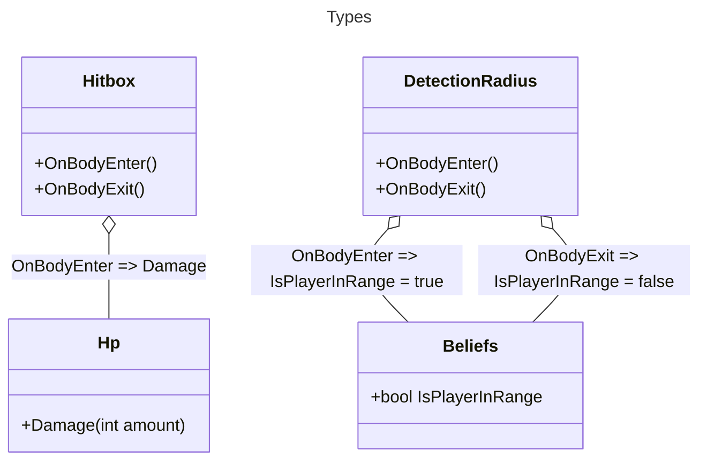

# Silver And Steel

Silver & Steel is a game I'm using to explore the basics of Godot.

## Getting Started

This section will cover how to setup the repo for development:

### Bootstrapping

To install dependencies for your host system, run:
- `tools/bootstrap/install.ps1` on Windows (uses winget)
- `tools/bootstrap/install.sh` on Mac or Linux (uses brew or system package manager)

This will install:

- Dotnet
  - `dotnet` will be added to your machine's `%PATH%`
- Git
  - Git & Unix Tools will be added to your machine's `%PATH%`
- Godot
  - `C:\opt\godot` will be used as the root path
  - The `%GODOT_BIN%` env var will be set
- Make
  - `make` will be added to your machine's `%PATH%`
- Python3 (for GDLint and friends)
  - `python` will be added to your machine's `%PATH%`
- VsCode

### Setup

This project uses a top-level `Makefile` runner for convenience. Use
`make setup` to setup `git` and install `gdtoolkit` into a `.venv`. Once this
completes, simply open in the godot editor!

# Check List

- [ ] Finish WalkState (CharacterBody2D.MoveTowards?)
- [ ] Generalized WalkTowardsPlayer()?
- [ ] General EntityDetector? Beliefs?
- [ ] Stats as a Resource?
- [ ] List of Area2D->State?
- [ ] Move appropriate actor classes to components
- [ ] Does using a derived CharacterState fix [Tool] not allowing setting via editor?

- More Composition?

```
Phantom
|-- Collider (CollisionShape2D)
|-- Animator (AnimationPlayer)
|-- Audio (AudioStreamPlayer2D)
|-- Directional (:Node2D)
|   |-- Sprite
|   |-- DetectionRadius (:Area2D)
|       |-- CollisionShape2D...
|   |-- Hitbox (:Area2D)
|       |-- CollisionShape2D...
|-- Hp
|-- Beliefs
|-- Hsm
```



# Asset Credits

- [Pixel Hero](https://rvros.itch.io/animated-pixel-hero) for protagonist
- [Oak Woods](https://brullov.itch.io/oak-woods) for tileset
- [Skeleton](https://astrobob.itch.io/animated-pixel-art-skeleton) enemy
- Shaders:
  - [Shine by Jacob Vanluven](https://godotshaders.com/author/kingtoot/)
- Sound Effects:
  - [Game Over, Sword Effects by Pixbay](https://pixabay.com/sound-effects/game-over-arcade-6435/)
  - [Menu Click by Not_Amasingrock](https://pixabay.com/sound-effects/video-game-menu-click-sounds-148373/)
- Engine:
    - [actor](https://freeicons.io/video-production-4/actor-talent-performer-celebrity-man-icon-705372#)
    - [armor](https://freeicons.io/icon/rpg-and-fantasy/armor-fantasy-item-knight-medieval-rpg-icon-455155#)
    - [enemy](https://freeicons.io/icon/rpg-and-fantasy/creature-fantasy-monster-ogre-orc-troll-icon-455175#)
    - [fire](https://freeicons.io/icon/rpg-and-fantasy/destruction-destructive-magic-fantasy-fire-rpg-sorcerer-icon-455165#)
    - [flip](https://freeicons.io/photo-editor-7/edit-flip-image-mirror-icon-93598#)
    - [fsm/state by Grafixpoint](https://www.flaticon.com/free-icons/chrono)
    - [globe](https://freeicons.io/office-and-workstation-icons-5/globe-icon-18889#)
    - [log](https://freeicons.io/rpg-and-fantasy/fantasy-game-magic-magician-parchment-spell-scroll-icon-455178)
    - [map](https://freeicons.io/icon/rpg-and-fantasy/adventure-adventure-map-fantasy-map-quest-icon-455176#)
    - [network](https://freeicons.io/team-management-icon-set-17/natwoarkingbusiness-communication-global-networking-world-icon-icon-790132)
    - [potion](https://freeicons.io/icon/rpg-and-fantasy/bottle-chemistry-elixir-fantasy-game-liquid-icon-455170#)
    - [protagonist](https://freeicons.io/icon/rpg-and-fantasy/armor-fantasy-helmet-knight-medieval-paladin-icon-455169#)
    - [sack](https://freeicons.io/icon/rpg-and-fantasy/bag-coin-game-gold-item-bag-pouch-icon-455166#)
    - [stats by Andrean Prabowo](https://www.flaticon.com/free-icons/bar-chart) (flaticon.com)
- Fonts:
    - [Knights Quest](https://www.1001freefonts.com/knights-quest.font)
- https://luizmelo.itch.io/fire-worm
- https://clembod.itch.io/bringer-of-death-free
- https://kyrise.itch.io/kyrises-free-16x16-rpg-icon-pack
- https://ansimuz.itch.io/warped-shooting-fx
- https://shikashipx.itch.io/shikashis-fantasy-icons-pack
