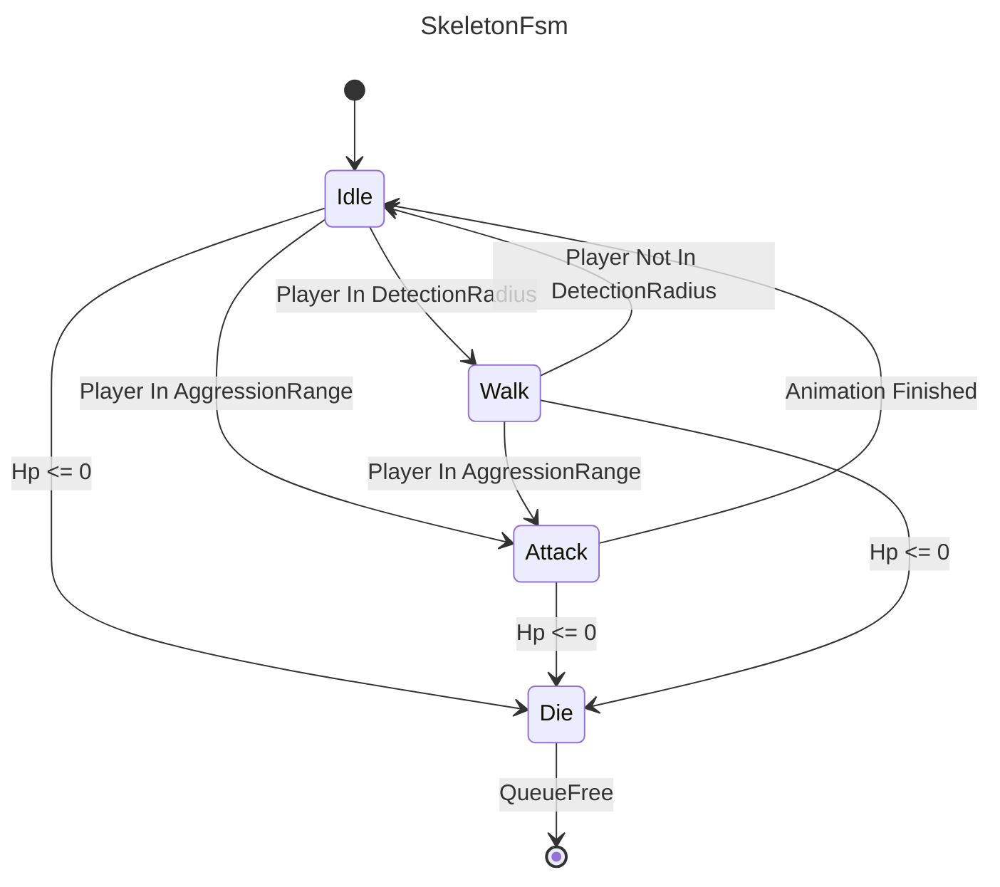

```mermaid
---
title: SkeletonFsm
---
stateDiagram

    [*] --> Idle
    Idle --> Attack : Player In AggressionRange
    Attack --> Idle : Animation Finished
    Walk --> Attack : Player In AggressionRange

    Idle --> Walk : Player In DetectionRadius
    Walk --> Idle : Player Not In DetectionRadius

    Idle --> Die : Hp <= 0
    Attack --> Die : Hp <= 0
    Walk --> Die : Hp <= 0
    Die --> [*] : QueueFree
```
